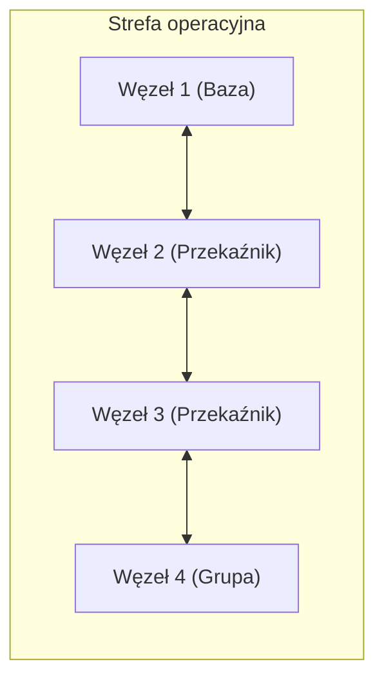

# Model Sieci Cyfrowej 2.4 GHz (Mesh Topology)

Projekt przedstawia koncepcyjny model cyfrowej sieci łączności bliskiego zasięgu, zoptymalizowanej do pracy w środowiskach o dużym tłumieniu sygnału (budynki, tunele, parkingi podziemne).

---

## 1. Architektura sieci (Mesh)

System wykorzystuje topologię mesh, w której każdy węzeł może pełnić rolę przekaźnika (relay node), umożliwiając omijanie przeszkód oraz zwiększenie zasięgu efektywnego.


Cechy architektury:
        topologia rozproszona (brak pojedynczego punktu awarii)
        automatyczna retransmisja (multi-hop)
        adaptacja do warunków środowiskowych
  
2. Specyfikacja techniczna
        Parametr	Wartość
        Pasmo RF	2405–2480 MHz (ISM)
        Modulacja	DSSS (Direct Sequence Spread Spectrum)
        Szyfrowanie	AES-128
        Kodowanie	CVSD (Continuous Variable Slope Delta)
        Tryb pracy	Full-Duplex
3. Charakterystyka propagacji
3.1 Porównanie pasm
        Cecha	VHF (149 MHz)	2.4 GHz (Mesh)
        Zasięg otwarty	bardzo duży	średni (~700 m)
        Zasięg w budynkach	słaby	wysoki
        Długość fali	~2 m	~12 cm
        Odporność na podsłuch	niska	wysoka (AES)
3.2 Tłumienie sygnału
        Materiał	Tłumienie	Wpływ na transmisję
        Szkło	2–3 dB	pomijalny
        Drewno / GK	4–6 dB	umiarkowany
        Cegła	8–15 dB	znaczący
        Beton	20–30 dB	krytyczny
        Metal	>40 dB	blokada sygnału
4. Mechanizmy działania
        Mesh Routing – dynamiczne trasowanie pakietów między węzłami
        Multi-hop Transmission – przekazywanie danych przez kolejne węzły
        LPI/LPD – ograniczona wykrywalność transmisji
        Redundancja ścieżek – odporność na awarie węzłów
5. Zastosowania
        komunikacja wewnątrz budynków
        systemy ratownicze i kryzysowe
        infrastruktura przemysłowa
        sieci ad-hoc i taktyczne
6. Ograniczenia
        wysokie tłumienie przez beton i metal
        ograniczony zasięg pojedynczego węzła
        zależność od gęstości sieci (liczby node’ów)
7. Słownik pojęć
        Termin	Opis
        Mesh	sieć, w której każdy węzeł może przekazywać dane
        Multi-hop	transmisja przez wiele węzłów
        DSSS	technika rozpraszania widma zwiększająca odporność na zakłócenia
        LPI/LPD	Low Probability of Intercept / Detection
8. Disclaimer
    Projekt ma charakter edukacyjny i koncepcyjny.
    Wykorzystanie urządzeń radiowych wymaga zgodności z lokalnymi przepisami prawa oraz odpowiednich uprawnień.
    Autor nie ponosi odpowiedzialności za wykorzystanie przedstawionych informacji w praktyce.

9. Autor
    Projekt koncepcyjny – sieć mesh 2.4 GHz

## 10. Quick Start / Proof of Concept

Poniższy przykład przedstawia uproszczony scenariusz testowy działania sieci mesh 2.4 GHz w środowisku zamkniętym.

### Założenia testowe

- liczba węzłów: 4
- topologia: mesh / multi-hop
- pasmo: 2.4 GHz ISM
- środowisko: budynek, tunel lub parking podziemny
- cel: sprawdzenie retransmisji sygnału między węzłami

### Przykładowa konfiguracja

| Węzeł | Rola | Lokalizacja | Funkcja |
|------|------|-------------|---------|
| Node 1 | Base Station | wejście / punkt kontrolny | punkt startowy komunikacji |
| Node 2 | Relay Node | korytarz / środek strefy | retransmisja |
| Node 3 | Relay Node | za przeszkodą | retransmisja |
| Node 4 | End Node | grupa końcowa | odbiór / nadawanie |

### Scenariusz testowy

1. Uruchom wszystkie węzły w tej samej sieci logicznej.
2. Umieść `Node 1` jako punkt bazowy.
3. Rozmieść `Node 2` i `Node 3` pomiędzy bazą a grupą końcową.
4. Umieść `Node 4` za przeszkodą, np. ścianą betonową lub zakrętem tunelu.
5. Zweryfikuj, czy komunikacja między `Node 1` i `Node 4` odbywa się przez przekaźniki.
6. Sprawdź stabilność połączenia po wyłączeniu jednego z węzłów pośrednich.

### Oczekiwany rezultat

System powinien automatycznie wykorzystać dostępne węzły pośrednie do przekazania transmisji.

W przypadku utraty jednego przekaźnika sieć powinna próbować zestawić alternatywną ścieżkę komunikacji, o ile istnieje wystarczająca liczba aktywnych węzłów.

### Schemat PoC

```mermaid
graph LR
    Base["Node 1: Base Station"]
    RelayA["Node 2: Relay Node"]
    RelayB["Node 3: Relay Node"]
    End["Node 4: End Node"]

    Base <--> RelayA
    RelayA <--> RelayB
    RelayB <--> End

    Base -. "alternate path" .-> RelayB
    RelayA -. "fallback" .-> End


   
